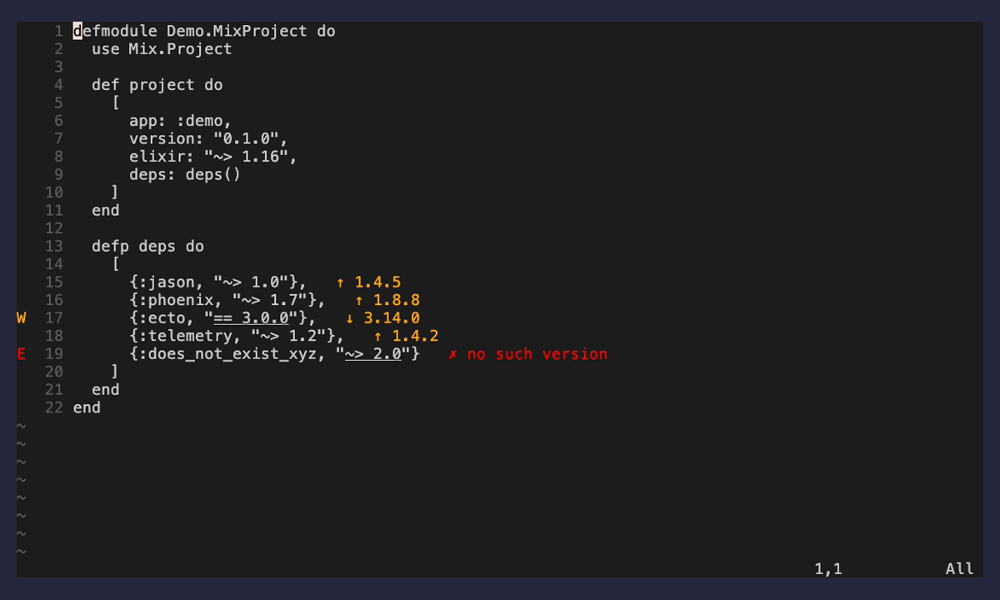

# hex-outdated.nvim

[](https://github.com/jpease/hex-outdated.nvim/actions/workflows/ci.yml)
[](LICENSE)
[](https://neovim.io)

Live "are my Hex deps up to date?" feedback for Elixir `mix.exs`, in the spirit
of crates.nvim. As you edit `mix.exs`, each dependency's declared version
requirement is checked against hex.pm: inline virtual text shows the latest
version and status, and non-existent versions/packages surface as diagnostics.



## Features

- Live inline virtual text as you edit `mix.exs` — no `:command` needed
- Status at a glance: up to date, upgradable, outdated pin, or non-existent
- Non-existent versions/packages also surface as real `vim.diagnostic` entries
- One-key actions: upgrade the requirement under the cursor, browse published
  versions, or open the package on hex.pm
- Treesitter parsing with a dependency-free Lua-pattern fallback
- Reads `mix.exs` directly — no `mix.lock` and no shelling out to `mix`
- Async, cached hex.pm requests; configurable text, highlights, and keymaps

## Requirements

- Neovim 0.10+
- `curl` on `PATH`
- (Recommended) the `elixir` Treesitter parser (`:TSInstall elixir`); a
  Lua-pattern fallback is used if it is missing.

## Install

With [lazy.nvim](https://github.com/folke/lazy.nvim):

```lua
{
  "jpease/hex-outdated.nvim",
  ft = "elixir",
  opts = {},
}
```

With [packer.nvim](https://github.com/wbthomason/packer.nvim):

```lua
use({
  "jpease/hex-outdated.nvim",
  config = function()
    require("hex-outdated").setup({})
  end,
})
```

With [mini.deps](https://github.com/echasnovski/mini.deps):

```lua
MiniDeps.add({ source = "jpease/hex-outdated.nvim" })
require("hex-outdated").setup({})
```

With [vim-plug](https://github.com/junegunn/vim-plug):

```vim
Plug 'jpease/hex-outdated.nvim'
" after plug#end():
lua require("hex-outdated").setup({})
```

As a native package (no plugin manager):

```sh
git clone https://github.com/jpease/hex-outdated.nvim \
  ~/.config/nvim/pack/plugins/start/hex-outdated.nvim
```

```lua
-- in your init.lua
require("hex-outdated").setup({})
```

Every manager other than lazy.nvim's `opts = {}` needs an explicit
`require("hex-outdated").setup({})` call — the plugin activates entirely through
`setup()`.

## Usage

Open a `mix.exs` — status appears automatically and updates as you type.

`:HexOutdated {refresh|toggle|upgrade|versions|open}` (bare `:HexOutdated` = refresh)

| Subcommand | Action |
|---|---|
| `refresh`  | Re-fetch, bypassing the cache. |
| `toggle`   | Enable/disable the inline display for the current buffer. |
| `upgrade`  | Rewrite the requirement under the cursor to the latest published version. |
| `versions` | Floating window of published versions; `<CR>` inserts the selected one, `q`/`<Esc>` closes. |
| `open`     | Open the package's page on hex.pm in a browser. |

The same actions are exposed as functions so you can bind your own keys:

```lua
local hex = require("hex-outdated")
-- hex.refresh() / hex.toggle() / hex.upgrade() / hex.versions() / hex.open()
```

## Status meanings

| Status | Meaning |
|---|---|
| `up_to_date` | The requirement already allows the latest stable release. |
| `upgradable` | A newer minor/major exists than your requirement targets. |
| `outdated`   | An exact pin (`==`) that is below the latest release. |
| `invalid`    | No published version matches the requirement (also a diagnostic). |

Git/path deps and requirements the plugin can't analyze (combined `and`/`or`
clauses) are left unannotated.

## Configuration

`setup` merges your options over the defaults:

```lua
require("hex-outdated").setup({
  enabled = true,
  auto_update = true,        -- re-analyze on buffer changes
  debounce_ms = 500,
  api = {
    base_url = "https://hex.pm/api",
    timeout_ms = 5000,
    max_concurrent = 8,        -- cap on simultaneous curl processes
  },
  cache = {
    ttl_seconds = 3600,
    error_ttl_seconds = 60,    -- how long a failed fetch is cached before retry
  },
  text = {                   -- %s is the latest version
    up_to_date = "✓ %s",
    upgradable = "↑ %s",
    outdated = "↓ %s",
    invalid = "✗ no such version",
    loading = "…",
    error = "fetch error",
  },
  highlight = {              -- highlight group per status
    up_to_date = "HexOutdatedUpToDate",
    upgradable = "HexOutdatedUpgradable",
    outdated = "HexOutdatedOutdated",
    invalid = "HexOutdatedInvalid",
    loading = "HexOutdatedLoading",
    error = "HexOutdatedError",
  },
  popup = { border = "rounded", max_height = 20 },
  -- opt-in buffer-local keymaps (unset by default):
  keymaps = {}, -- e.g. { upgrade = "<leader>cu", versions = "<leader>cv", open = "<leader>co" }
})
```

Highlight groups link to `Diagnostic*` by default and respect your colorscheme
if you define them first: `HexOutdatedUpToDate`, `HexOutdatedUpgradable`,
`HexOutdatedOutdated`, `HexOutdatedInvalid`, `HexOutdatedLoading`,
`HexOutdatedError`.

## How it works

`mix.exs` is parsed with Treesitter (Lua-pattern fallback) to find top-level
dependency tuples and their requirement strings. For each Hex dependency the
plugin asynchronously queries `https://hex.pm/api/packages/:name` (cached), then
compares your requirement against the published versions to classify it. Current
state is read from `mix.exs` itself — no `mix.lock` and no shelling out to `mix`.

## Development

```
just check     # stylua --check, luacheck, busted, headless-nvim suite
just test      # busted (pure logic, no Neovim)
just test-nvim # headless-Neovim integration suite
just format    # stylua
just lint      # luacheck
```

Pure logic (`version`, the fallback parser, `util`, classification) is unit-tested
with busted under `spec/`. The Neovim-coupled modules — Treesitter parsing,
extmark/diagnostic rendering, the curl queue, and buffer actions — are exercised
against a real headless Neovim under `test/`, run with
`nvim --headless -u NONE -l test/run.lua` (no busted/luarocks needed). Both
suites run in CI.

## License

[MIT](LICENSE) © Justin Pease
